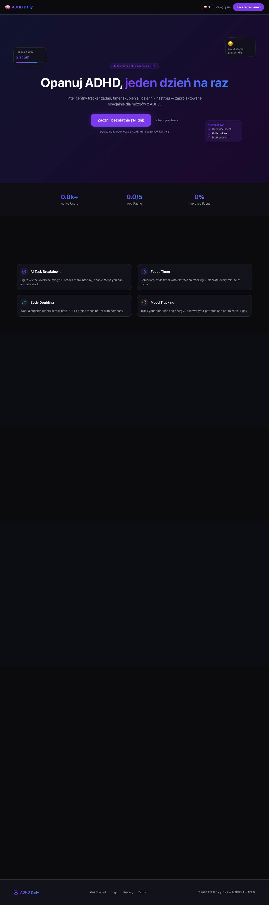

# Rewire — Behavioral Change App

> Break bad habits. Build better ones. One drill at a time.

**Status:** Live

---

## What it does

- Micro-drills for improving focus and sustained attention
- Task decomposition: large goals auto-split into 5-minute actionable steps
- Gamified habit tracking with streaks, dopamine rewards, and achievement badges
- Support for breaking addictions through structured daily routines
- Energy-aware task suggestions matching current capacity (high/low energy modes)

## How it works

- **Micro-step engine**: Users input large tasks which are split into timed 5-min steps with completion tracking and dopamine reward animations on finish
- **Local-first state**: All task data stored in localStorage via custom state hook with auto-save; optional Supabase cloud sync for stats and achievements
- **Gamification layer**: Pomodoro counter, daily streak tracking with Streak Freeze powerup, achievement badges unlocked at milestones, weekly review summaries
- **ADHD-optimized UX**: Fast visual feedback via toast notifications, reward screens on task completion, Framer Motion animations for engagement

## Tech Stack

   
