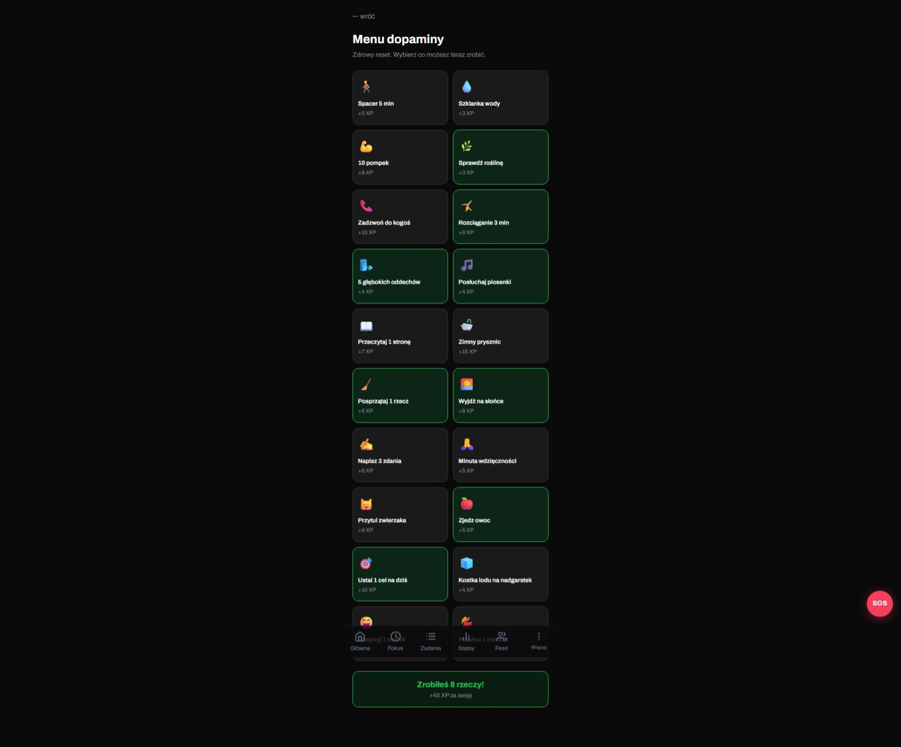
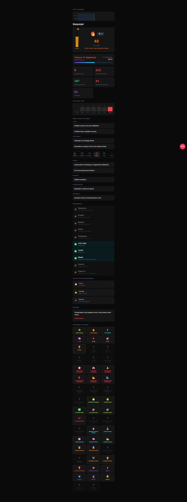
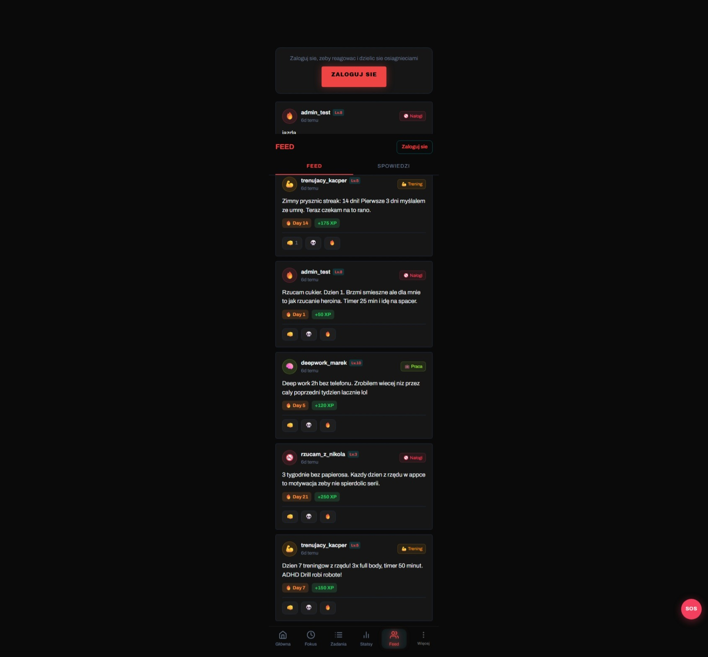
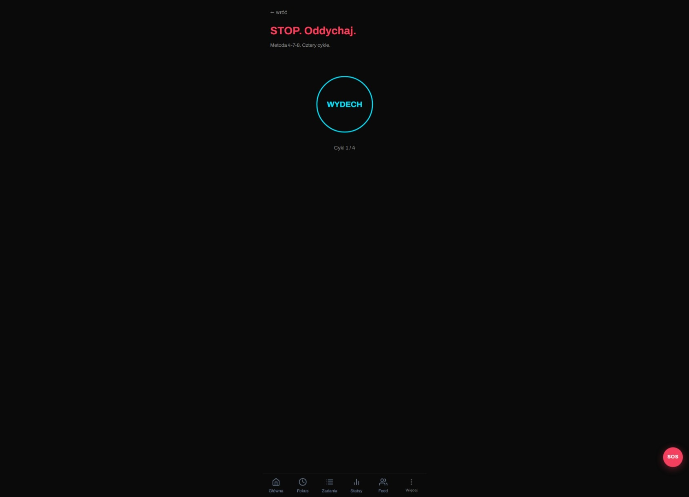
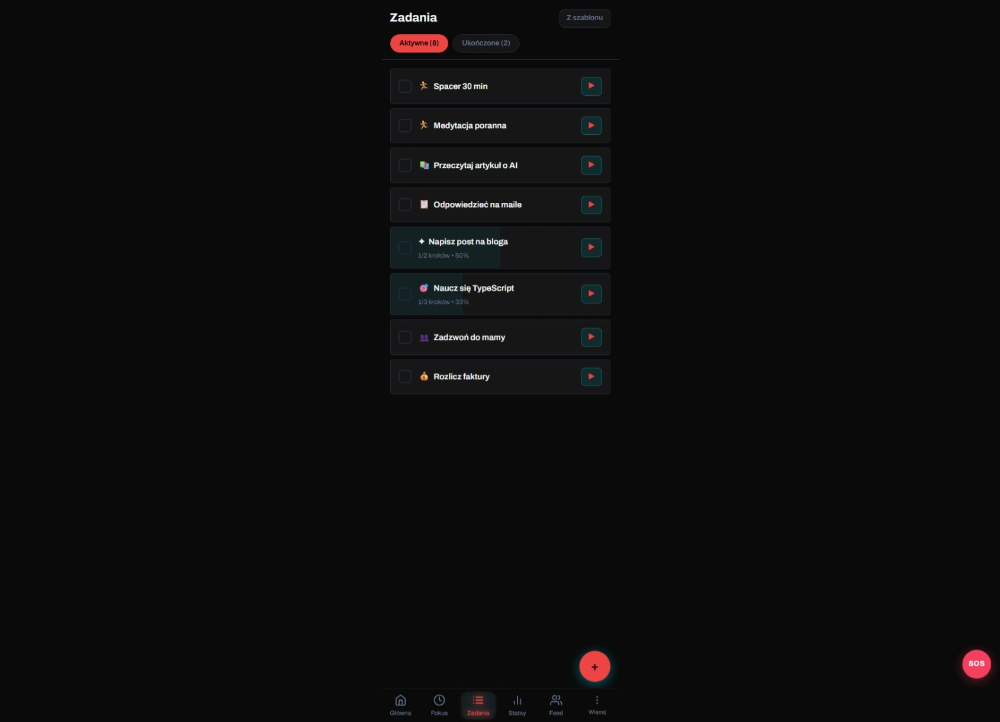

# Rewire

> ADHD productivity app — focus timer, habit tracking, AI coach, collaborative work rooms.

## What is it

Rewire is a PWA (Progressive Web App) designed specifically for people with ADHD. It combines CBT and focus therapy techniques with gamification and social support. Instead of traditional to-do lists — a "one thing" system, quick wins, a Pomodoro timer with an AI coach, and real-time collaborative work rooms (body doubling).

## Features

- **"One thing" mode** — focus on a single task with a minimalist UI that eliminates distractions
- **Quick Wins** — list of small tasks completable in under 5 minutes for building momentum
- **Focus Timer** — Pomodoro with an AI coach that adapts session length to the user's energy level
- **Rooms (body doubling)** — real-time collaborative work with other users
- **Panic Button** — immediate breathing exercises and helpline links when overwhelmed
- **AI Coach** — motivational nudges and session check-ins
- **Dopamine tracking** — wellbeing tracking, rewards, streak heatmap
- **Brain Dump** — quick thought offloading without structure, organize later
- **Calendar** — task integration with daily/weekly view
- **PWA** — works offline, installable on iOS/Android
- **Supabase Auth** — email/password or magic link login

## Stack

| Layer | Technology |
|-------|-----------|
| Frontend | Next.js, React, TypeScript, Tailwind CSS |
| Auth | Supabase Auth (SSR) |
| Database | Supabase (PostgreSQL + RLS) |
| Animations | Framer Motion |
| PWA | Service Worker, Web App Manifest |
| Deploy | Vercel |

**Tooling:** @vercel/og (social preview images)

## Privacy

Brain Dump and Dopamine Tracking handle sensitive personal data. Our approach:

- **Encryption at rest**: all user data encrypted by Supabase (AES-256)
- **No AI training**: your journal entries and focus logs are never used to train any model
- **Data export**: export all your data as JSON at any time from Settings
- **Deletion**: full account and data deletion available from Settings, processed within 24 hours
- **No third-party analytics** on the journaling or tracking pages
- **Subprocessors**: Supabase (PostgreSQL, Auth), Vercel (hosting), Anthropic via OpenRouter (AI Coach inference only, no data retention)

## Architecture notes

**Real-time Body Doubling rooms**: Supabase Realtime broadcast channels for presence and chat. Optional video via WebRTC (simple-peer). Room state machine: open -> filling -> in-session -> ended. Capacity: 2-8 participants per room.

**AI Coach**: Claude Haiku via OpenRouter. System prompt grounds responses in CBT and ACT principles. The coach does not provide medical advice. If a user mentions self-harm or crisis, the response immediately surfaces emergency contacts: Telefon Zaufania 116 123 and emergency services 112.

**PWA offline**: One-Thing Mode, Focus Timer, and Brain Dump work fully offline via Service Worker. Data syncs to Supabase when connection is restored.

## Status

Open Beta - [rewirev10.vercel.app](https://rewirev10.vercel.app)
Available features: One-Thing Mode, Quick Wins, Focus Timer, Brain Dump, Dopamine Tracking.
In development: Body Doubling rooms (real-time presence), AI Coach with episodic memory.

---
Built by [Emil Piński](https://emilpinski.pl)

> Source code is private. [Contact for collaboration](mailto:emilpinskidev@gmail.com)

## Screenshots

